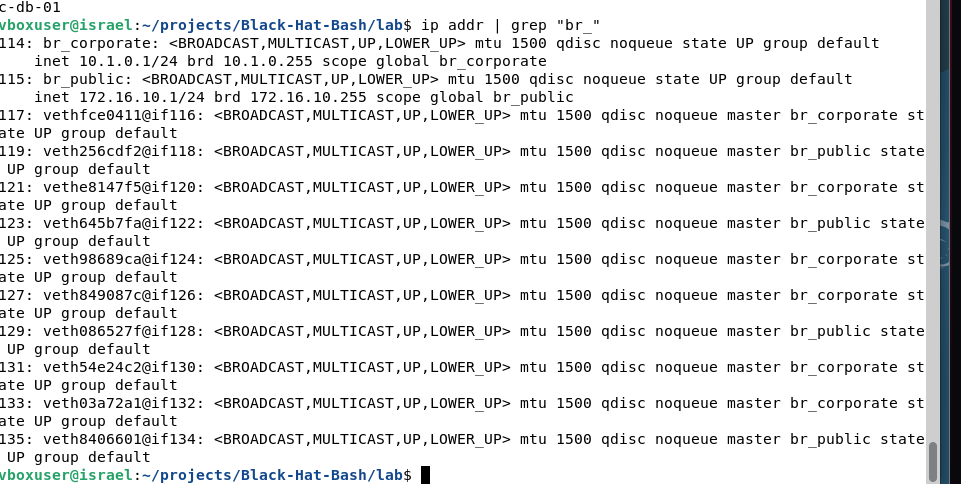
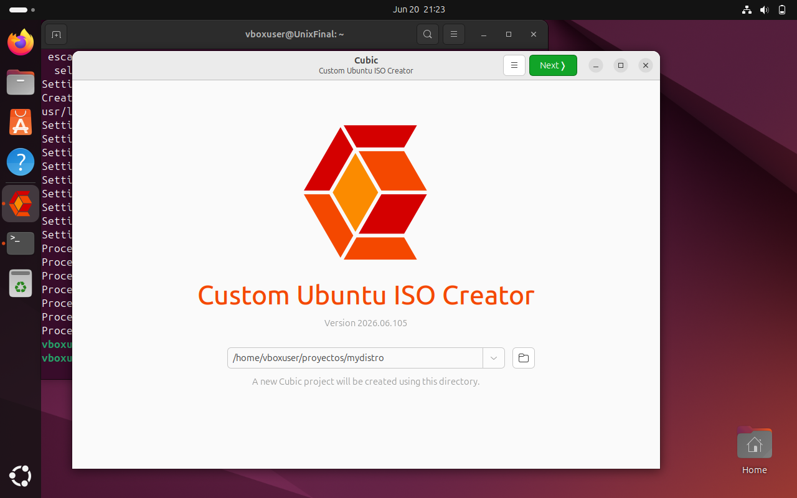

# Integrative-Project-Deliverables
Integrative Project: Deliverables by Andres Pesantez, Ariel Yumbillo and Israel Farfan
##  Project Description
What is a cubic? Cubic is a aplication to create own distro with some free software aplications, it depends on the person or group.

---
##  ISO Technical Specifications
* **Filename:** `IAAdis-desktop-amd64.iso`
* **Approximate Size:** ~6.04 GiB
* **Base OS:** Ubuntu / Linux Mint (64-bit)
## We need install cubic into our vm with ubuntu or anyone distribution
Use the codes into the cubic repo

## Then we have the aplication into the virtual box

---
## Set up cubic
When we have cubic we need a directory where save the info.

Also we use a distro like linux mint to clone the distro for own distro.

##  Deployment Instructions in VirtualBox
1. Create a new Virtual Machine, setting the Type to **Linux** and Version to **Ubuntu (64-bit)**.
2. Allocate a minimum of **2 CPU Cores** and **4 GB of RAM**.
3. **Crucial Step:** Check the **"Skip Unattended Installation"** box.
4. Under the Storage tab, mount the custom `IAAdis-desktop-amd64.iso` file onto the Virtual Optical Drive.
5. *(Troubleshooting)* If you encounter a black screen or video freezing on startup, change the Graphics Controller to **`VBoxSVGA`** and max out Video Memory to **128 MB**.
6. Fire up the VM. The system will boot straight into your customized **Live OS** desktop environment.

---

