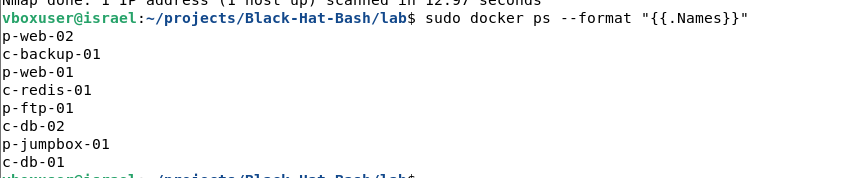

# Integrative-Project-Deliverables
Integrative Project: Deliverables by Andres Pesantez, Ariel Yumbillo and Israel Farfan
# Part 3 — Initiate and Engage with the Black Hat Bash Lab
Course: Introduction to UNIX — SIN-B
Reference: Chapter 3, Black Hat Bash

---

# Part 3. A — Laboratory Setup and Confirmation

Environment

# Operating System

```text
Debian GNU/Linux 13 (Trixie)
```

# Docker Version

```text
Docker version 26. 1. 5+dfsg1
```

# Docker Compose Version

```text
Docker Compose version 2. 26. 1-4
```

---

Repository Cloning

The repository for Black Hat Bash was successfully copied, and access to the lab directory was achieved.

```bash
git clone https://github. com/dolevf/Black-Hat-Bash. git
cd Black-Hat-Bash/lab
```

---

Laboratory Setup

The lab environment was established using the following command:

```bash
sudo make deploy
```

The deployment was carried out successfully.

# Evidence

```text
OK: all containers appear to be running.
OK: Lab is up and provisioned.
```

---

Laboratory Confirmation

The deployment was examined using:

```bash
sudo make test
```

# Output

```text
Lab is up.
```

---

Running Containers

Command:

```bash
sudo docker ps --format "{{. Names}}"
```

# Output

```text
p-web-02
c-backup-01
p-web-01
c-redis-01
p-ftp-01
c-db-02
p-jumpbox-01
c-db-01
```

A total of 8 containers were operating correctly.

---

Network Validation

Command:

```bash
ip addr | grep "br_"
```

# Output

```text
br_corporate 10. 1. 0. 1/24
br_public 172. 16. 10. 1/24
```

The two necessary networks were successfully established.

| Network | Gateway |
|----------|----------|
| Public | 172. 16. 10. 1/24 |
| Corporate | 10. 1. 0. 1/24 |

---

Verification of Container Access

Command:

```bash
sudo docker exec -it p-web-01 bash
```

Hostname confirmation:

```bash
hostname
```

# Output

```text
p-web-01. acme-infinity-servers. com
```

Successful access to the shell verifies that the container is functioning.

---

# Laboratory Architecture

| Machine | Hostname |
|----------|----------|
| p-web-01 | p-web-01. acme-infinity-servers. com |
| p-web-02 | p-web-02 |
| p-ftp-01 | p-ftp-01 |
| p-jumpbox-01 | p-jumpbox-01 |
| c-db-01 | c-db-01 |
| c-db-02 | c-db-02 |
| c-redis-01 | c-redis-01 |
| c-backup-01 | c-backup-01 |

---

# Network Diagram

```text
PUBLIC NETWORK
172. 16. 10. 0/24
|
br_public
|
-----------------------------------
| | | |
p-web-01 p-web-02 p-ftp-01 p-jumpbox-01


CORPORATE NETWORK
10. 1. 0. 0/24
|
br_corporate
|
-----------------------------------
| | | |
c-db-01 c-db-02 c-redis-01 c-backup-01
```

---

# Part 3. B — Port Scanning Method Utilizing Nmap

Goal

Conduct a fundamental reconnaissance scan of the target:

```text
172. 16. 10. 10
```

---

Command Executed

```bash
nmap -sV 172. 16. 10. 10
```

---

Outcomes

```text
PORT STATE SERVICE VERSION
8081/tcp open http Werkzeug httpd 3. 0. 1 (Python 3. 12. 3)
```

---

Function of This Technique

Nmap serves as a network scanning tool designed to detect open ports, ongoing services, and software versions on remote computers.

The `-sV` parameter activates service and version identification.

---

Reason for Its Effectiveness

Network services operate on designated TCP or UDP ports. By connecting to these ports and assessing the replies, Nmap can ascertain whether a service is active and reveal the software that powers it.

---

Information Acquired

The scan revealed:

- One accessible TCP port.
- An HTTP service present on port 8081.
- Werkzeug HTTP Server version 3. 0. 1.
- Python version 3. 12. 3.

---

Interpretation

The target system runs a web application that can be accessed via TCP port 8081.

The application seems to be built with Python and utilizes Werkzeug, a widely-used WSGI web server commonly associated with Flask applications.

This knowledge is significant as it enables a security analyst to:

- Recognize the web technology framework.
- Investigate potential vulnerabilities.
- Organize further enumeration and testing procedures.
- Assess the exposed attack surface of the target.

---

Conclusion

The Black Hat Bash lab was implemented successfully using Docker on Debian 13. All eight containers were functioning properly, the necessary networks were established correctly, and access to the target system was confirmed. A reconnaissance scan conducted with Nmap effectively detected an operational web service along with its foundational technologies, illustrating the efficiency of fundamental network enumeration methods.


